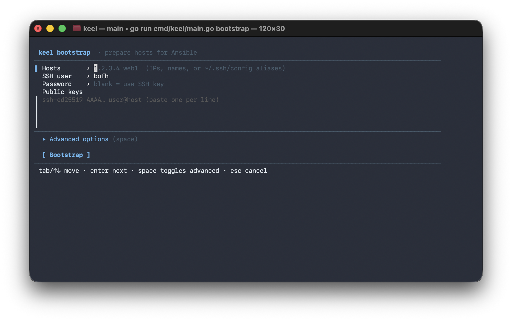

<p align="center">
  
</p>

<p align="center">
  <a href="https://github.com/DigitalTolk/keel/actions/workflows/ci.yml"></a>
  <a href="https://goreportcard.com/report/github.com/DigitalTolk/keel"></a>
  <a href="https://github.com/DigitalTolk/keel/releases"></a>
  <a href="LICENSE"></a>
</p>

The first step in server setup. **keel** prepares a fresh machine for Ansible — scans host keys, creates the admin user with a passwordless sudoers drop-in, and seeds SSH keys — then hands off to Ansible. That is all it does. One static binary, no runtime. SSH is native (`golang.org/x/crypto/ssh`); nothing is shelled out. Run it with no arguments for a guided, interactive setup.

## Install & use

```sh
curl -fsSL https://raw.githubusercontent.com/DigitalTolk/keel/main/install.sh | bash
```

Picks the right build for your OS/arch (Linux & macOS, amd64 & arm64), verifies its checksum against the GitHub release, and installs `keel` to `/usr/local/bin` (or `~/.local/bin` without root). Pin a version with `KEEL_VERSION=v1.2.0`.

Or with Homebrew (macOS & Linux):

```sh
brew install DigitalTolk/tools/keel
```

Or, with a Go toolchain:

```sh
go install github.com/DigitalTolk/keel/cmd/keel@latest
```

Then:

```sh
keel --version
keel <command> --help      # every command and flag is self-documented
```

Configuration resolves as **flags → environment → file**. The file lives at `./keel.yaml`, `~/.config/keel/config.yaml`, or `/etc/keel/config.yaml` and holds SSH defaults (user, port, jump host); the legacy `SSH_USER` / `SSH_PORT` / `SSH_JUMP_HOST` env vars still work. The bootstrap password is never inlined — supply it interactively with `--ask-pass` or via `KEEL_SSH_PASSWORD`.

## Commands

```sh
keel known-hosts HOST...     # scan SSH host keys into ~/.ssh/known_hosts
keel bootstrap HOST...       # install packages, create admin user + sudoers, seed ssh keys
keel bootstrap               # no hosts -> guided, interactive setup (TUI)
```

<p align="center">
  
</p>

That is the entire surface: keel is only a server-bootstrap tool. In a terminal, `keel bootstrap [HOST...]` opens a full-screen guided form — **pre-filled with any HOST arguments and flags you pass** — then provisions, showing each step and its (capped) host output in a single live box. It's a single screen: hosts, SSH user, an optional password (blank = use your SSH key), and the public keys to install (one per line); the rarely-used options (port, jump host, admin user, identity / key file) sit behind a `space`-to-expand **advanced** toggle. `tab`/`shift+tab` (or `↑`/`↓`) move between fields, `enter` advances, and the **[ Bootstrap ]** button runs it (`enter`/`space`); `esc` cancels. Each field shows an inline hint. On connect the host key is accepted automatically (like `StrictHostKeyChecking=no`). Piped or non-interactive, it runs straight from the flags — `keel bootstrap --help` lists them all (`--user`, `--port`, `--jump`, `--ask-pass`, `--identity`, `--pubkey`, `--pubkey-file`, `--admin-user`).

**`~/.ssh/config` is honored.** If a host is an alias in your SSH config, keel resolves its `HostName`, `User`, `Port`, `IdentityFile`, and `ProxyJump` (explicit flags / TUI values always win). So `keel bootstrap web1` works when `web1` is defined in `~/.ssh/config`.

### What bootstrap does

On each host, over SSH (privileged steps elevated via the connecting user — direct as root, `sudo`, or `sudo -S` with a password, sent base64-encoded so nothing sensitive hits the command line):

1. **Installs base packages** — `apt-get update` then `sudo python3 python3-apt acl` (what Ansible needs on the target), non-interactively.
2. **Creates the admin user** (`bofh` by default) with a home dir and `/bin/bash` — only if it doesn't already exist and you didn't connect as it.
3. **Writes a passwordless sudoers drop-in** at `/etc/sudoers.d/100-no-pass-users` (`<admin> ALL=(ALL) NOPASSWD:ALL` + `Defaults:<admin> !requiretty`), validated with `visudo -cf` and installed atomically at mode `0440`.
4. **Ensures `~admin/.ssh`** (owned by the admin, mode `0750`).
5. **Seeds `authorized_keys`** with each supplied public key, idempotently (no duplicates), owned by the admin at mode `0640`.

After this the admin user can log in by key with passwordless sudo — ready for Ansible.

## License

MIT — see [LICENSE](LICENSE).

---

<sub>keel is based on [lifeofguenter/systools](https://github.com/lifeofguenter/systools).</sub>
<br><sub>🤖 Reimplemented in Go with [Claude Code](https://claude.com/claude-code).</sub>
